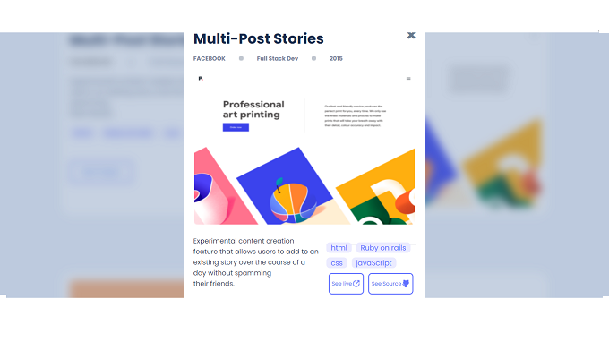

# Emmanuel's Portfolio

​
Showcasing my portfolio through esctatic web design project.

## Built With
​
- HTML 
- CSS
- JS
- Linters

## Live Demo
[Go Live](https://epaltechs.github.io/Popup-Window/)
​
## Getting Started
To get a local copy up and running, follow these simple steps:

- copy this link `https://github.com/Epaltechs/Setup-Portfolio.git`.
- get the directory that you want to clone the repository.
- open the command prompt in this directory.
- write `git clone https://github.com/Epaltechs/Setup-Portfolio/tree/Desktop-Version.`
- go to the repository folder in your command prompt `cd Setup-Portfolio`

## 👤 Author
### Emmnanuel Paul
- GitHub: [https://github.com/Epaltechs/Popup-Window]
- LinkedIn: [https://www.linkedin.com/in/emmanuel-paul-a2bab7b4/]
- Twitter: [http://twitter.com/@emmapaul247].
​
## 🤝 Contributor

#### Rwubakwanayo Olivier

Contributions, issues, and feature requests are welcome!

Feel free to check the [issues page](https://github.com/Epaltechs/Popup-Window/issues).

## Show your support
​
If you like this project you can support just by giving a like.
Emmanuel Paul to Everyone (10:25)

## Acknowledgments
Many thanks to Rwubakwanayo Olivier for your wonderful support.

## 📝 License

This project is [MIT](./MIT.md) licensed.
